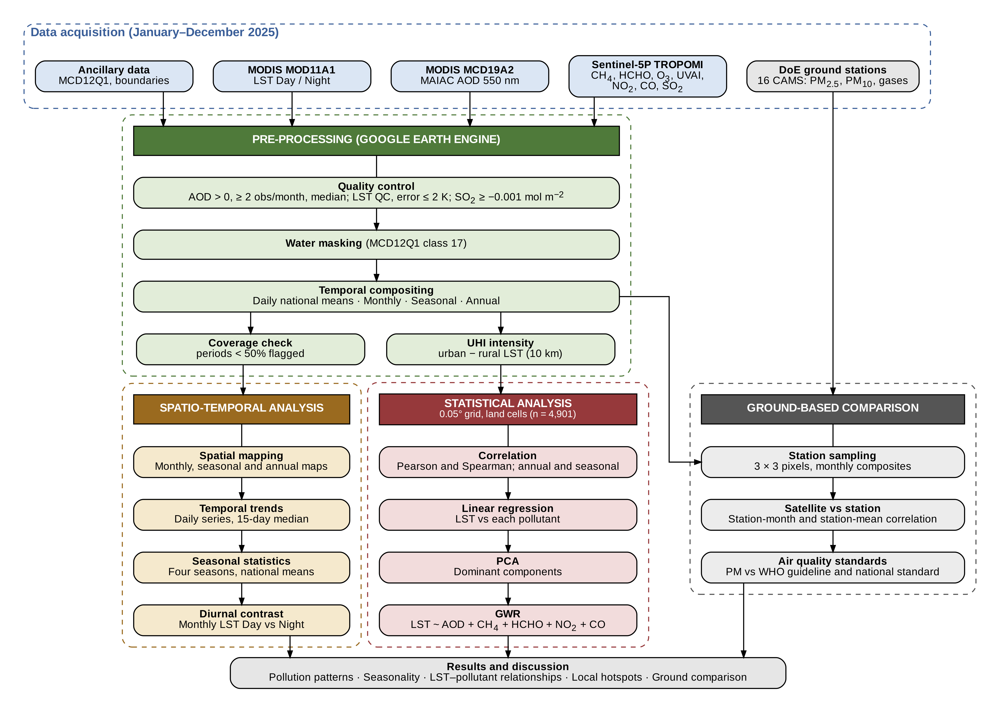

# Satellite-based air pollution and land surface temperature in Bangladesh (2025)

Scripts, tables and figures for a national-scale study of air pollutants and land surface temperature (LST) over Bangladesh for 1 January – 31 December 2025. Satellite data are processed in Google Earth Engine (GEE); maps and statistics are produced in Python. The workflow adapts the approach of Sameh et al. (Egypt) to Bangladesh.

**Status:** work in progress, unpublished. Please do not share outside the team.

## Workflow diagram



## Variables and data sources

| Variable | Product | Export scale |
|---|---|---|
| CH4, HCHO, O3, UVAI | Sentinel-5P TROPOMI OFFL L3 | 1,113 m |
| NO2, CO, SO2 | Sentinel-5P TROPOMI OFFL L3 | 1,113 m |
| AOD (550 nm) | MODIS MCD19A2 (MAIAC, C6.1) | 1,000 m |
| LST Day / Night | MODIS MOD11A1 (C6.1) | 1,000 m |
| Land cover (urban, water) | MODIS MCD12Q1 | 500 m |
| Ground PM2.5, PM10, NO2, SO2, CO, O3 | DoE CAMS monthly reports, 16 stations | – |

UHI is computed from annual daytime LST as pixel LST minus the mean rural LST within 10 km.

## Folder structure

```
bd-air-pollution-2025/
├── README.md
├── .gitignore
├── Script for GEE/            GEE scripts (JavaScript): raster and daily CSV exports
├── Scripts/                   Python scripts for maps and statistics
├── BD_AQ_2025/                Tables exported from GEE and station data (CSV only)
├── Figures_v2/                Final figures
│   ├── Annual/                Annual maps
│   ├── Monthly/               Monthly 4 × 3 panel maps
│   ├── Seasonal/              Seasonal maps, means and correlations
│   ├── Temporal/              Daily trends, monthly LST
│   ├── Statistics/            Correlation, regression, PCA, GWR
│   ├── StudyArea/             Study area map
│   └── Flowchart/             Workflow diagram
├── Station_validation/        Satellite vs DoE station comparison (tables and figure)
└── Manuscript/                Draft manuscript
```

**Raster files (.tif) are not in this repository** because they are too large for GitHub. They are in the team's Google Drive folder. To run the Python scripts, download them into `BD_AQ_2025/`.

## Workflow

### 1. Google Earth Engine

| Script | Purpose |
|---|---|
| `test-gee.js` | Exploratory tests: coverage, quality masks, compositing, UHI method |
| `for_all_Pollutants_GEE_script.js` | Main export: monthly (12-band) and annual rasters, UHI, coverage table, daily national means |
| `aod_daily_fix.js` | AOD daily means as 12 monthly tasks |
| `aod_check.js` | Visual check of AOD observation count and water mask (no exports) |
| `NO2_CO_SO2_GEE_script.js` | Monthly, annual and daily exports for NO2, CO and SO2 |

All rasters: EPSG:4326, no-data = −9999, Drive folder `BD_AQ_2025`.

### 2. Python

Run in this order:

| Step | Script | Output |
|---|---|---|
| 1 | `merge_aod_daily.py` | `AOD_daily_2025.csv` |
| 2 | `study_area_map.py` | Study area map |
| 3 | `panel_map.py` | Monthly 4 × 3 panel maps |
| 4 | `annual_map.py` | Annual maps |
| 5 | `temporal_trends.py` | Daily trends, monthly LST day/night |
| 6 | `correlation_matrix.py` | 0.05° pixel table, Pearson and Spearman matrices |
| 7 | `regression_plots.py` | LST vs pollutant regressions |
| 8 | `pca_analysis.py` | PCA scree plot, biplot, loadings |
| 9 | `gwr_analysis.py` | GWR coefficient maps and summary (main model and UVAI check model) |
| 10 | `seasonal_analysis.py` | Seasonal maps, seasonal means, seasonal LST–pollutant correlation |
| 11 | `station_validation.py` | Satellite vs station comparison, WHO / Bangladesh standard table |

Steps 7–9 read the pixel table made in step 6, so run step 6 first.

## How to run

1. Install the Python packages in a conda environment: `rasterio`, `geopandas`, `pandas`, `numpy`, `scipy`, `matplotlib`, `mgwr`.
2. Open each script and set `ROOT` (near the top) to your own project folder.
3. Run, for example:

```
conda activate gis
python panel_map.py
```

Each script prints `Done.` when it finishes.

## Processing notes

- AOD: values ≤ 0 removed, at least 2 observations per pixel per month, median composite, inland water masked.
- LST: only good-quality pixels with LST error ≤ 2 K.
- Months with < 50% valid pixels are labelled as insufficient data (monsoon cloud).
- One shared colour scale per variable across all months.
- O3 is converted from mol/m² to Dobson Units for mapping.
- NO2 and SO2 are shown in µmol/m² (mol/m² × 10⁶); SO2 values below −0.001 mol/m² are removed as noise.
- PM2.5 and PM10 are not estimated from satellite data; AOD is analysed directly.
- Seasons: winter (Dec–Feb, using Jan, Feb and Dec 2025), pre-monsoon (Mar–May), monsoon (Jun–Sep), post-monsoon (Oct–Nov).
- GWR: LST Day and LST Night ~ AOD + CH4 + HCHO + NO2 + CO (adaptive bisquare kernel, AICc bandwidth). UVAI, O3 and SO2 are left out of the main model; a second model with UVAI in place of AOD is run as a check.
- Station comparison: 3 × 3 pixel mean at each DoE station, station-months with at least 50% data capture.

## Contact

Habibullah (maintainer)
